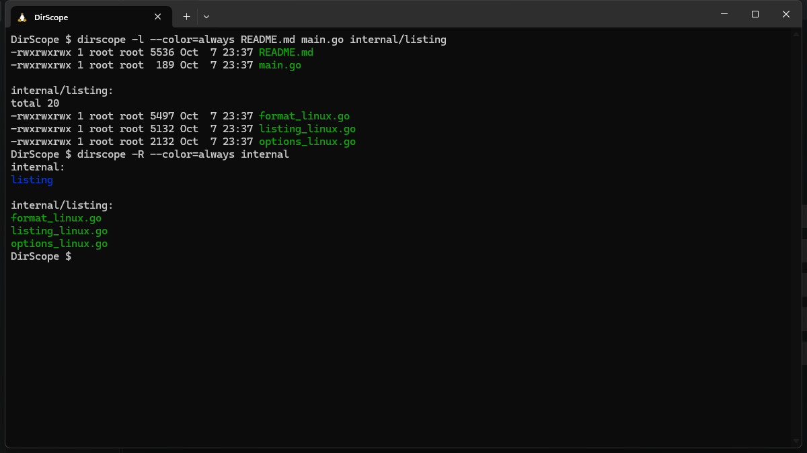

# DirScope: Command-Line File Listing Tool

DirScope is a Linux command-line tool written in Go for listing files and directories. It implements the core `ls` options, recursive traversal, and aligned long-format output using only the Go standard library. It reads filesystem metadata directly; it does not invoke the system `ls` or use `os/exec`.



*Actual terminal output from DirScope running in Ubuntu on WSL.*

## Features

| Option | Behavior |
| --- | --- |
| `-l` | Show file type, permissions, hard-link count, owner, group, size, modification time, and name. Symlinks include their target. |
| `-R` | Recursively list subdirectories with path headings. |
| `-a` | Include dotfiles and the current and parent entries (`.` and `..`). |
| `-r` | Reverse the selected sort order. |
| `-t` | Sort by modification time, newest first, with name ordering for ties. |
| `--color=auto\|always\|never` | Control name coloring. The default is `auto`, which enables colors for character-device output unless `TERM=dumb`. |
| `--help` | Show usage information. |
| `--` | End option parsing, allowing paths that begin with `-`. |

Flags may be grouped, repeated, or placed between paths. Multiple file and directory operands are supported; files are printed before directory contents. Explicitly named hidden files are listed even without `-a`.

Long listings include Linux special permission bits, device major/minor numbers, and directory totals in 1 KiB blocks. Owner and group names come from each entry's UID/GID, with numeric fallbacks when lookup fails. Old and future timestamps show the year.

Long listings honor `TIME_STYLE=long-iso`, `full-iso`, `iso`, or `locale`. With no setting, or with `locale`, timestamps use the English C-locale format. `iso` uses separate recent and non-recent formats; `full-iso` includes nanoseconds and the UTC offset. Unsupported values produce an error with exit code 2 for long listings; short listings ignore `TIME_STYLE`.

## Requirements and setup

- **Linux**, including Ubuntu running in Windows Subsystem for Linux (WSL).
- **Go 1.22.5 or newer** and Git for cloning. No third-party Go dependencies are required.

Run these commands in a Linux or WSL Ubuntu terminal:

```bash
git clone https://github.com/ihamzaihsan/DirScope.git
cd DirScope
go build -o dirscope .
./dirscope --help
```

For this existing Windows checkout, open Ubuntu and use:

```bash
cd /mnt/c/Users/hamza/Downloads/DirScope
go build -o dirscope .
./dirscope -la
```

The Linux executable must run inside Linux/WSL. Builds on other operating systems produce a small launcher that explains this requirement and exits with status 2.

## Usage

```text
dirscope [options] [path ...]
```

```bash
./dirscope                         # List the current directory
./dirscope /usr/bin                # List a directory
./dirscope README.md               # List a file operand
./dirscope -la                     # Long listing including hidden entries
./dirscope -l -t /usr/bin           # Long listing, newest first
./dirscope -lRr internal            # Recursive long listing in reverse order
./dirscope -l internal -a README.md # Mix options and operands
./dirscope -- -report.txt           # List a filename beginning with a dash
./dirscope --color=never -R internal
```

Errors go to standard error. Valid operands are still processed when another operand fails. Exit codes are `0` for success, `1` for entry metadata or symlink-read errors, and `2` for invalid options, inaccessible operands/directories, or output failures.

## Implementation

```text
main.go                             Linux entry point
main_unsupported.go                 Unsupported-platform message
internal/listing/options_linux.go   Argument parsing and help
internal/listing/listing_linux.go    Operand handling, traversal and sorting
internal/listing/format_linux.go     Linux metadata and output formatting
```

The implementation separates argument parsing, traversal, and formatting. A stable merge sort provides O(n log n) ordering while respecting the original assignment's allowed import list. UID/GID lookups are cached within each invocation. Directory handles are closed before recursive descent.

Directory entries use `Lstat`: recursion skips symlinks and excludes `.` and `..` from descent. In short mode, a directory symlink supplied as an operand is followed. In long mode it is displayed as a link; a trailing slash requests the target directory. User-supplied slash spelling is retained in directory headings.

## Scope and limitations

DirScope implements a focused subset of `ls`, rather than every GNU option or display convention:

- Short output uses one entry per line. Names use bytewise ordering, matching `LC_ALL=C`; locale-specific collation is not implemented.
- Long-format comparisons use GNU `ls` with `LC_ALL=C`, literal filename quoting, default block settings, and the supported named timestamp styles. Custom `TIME_STYLE=+FORMAT` strings, `posix-` prefixes, translated dates, `BLOCK_SIZE`, and ACL/SELinux indicators are not implemented.
- Printable filenames are shown literally; control characters are escaped to protect terminal output. GNU quoting and color themes are not reproduced.
- WSL-mounted Windows paths expose the permissions and ownership supplied by WSL, which may differ from files stored in Ubuntu's filesystem.
- Output is a filesystem snapshot attempt; concurrent changes can produce reported errors. There is no fixed runtime guarantee for arbitrary directory trees.
